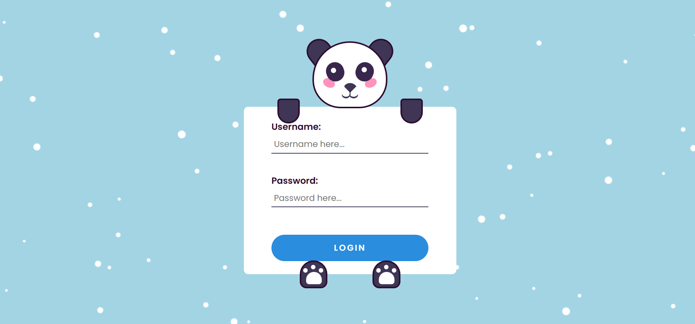
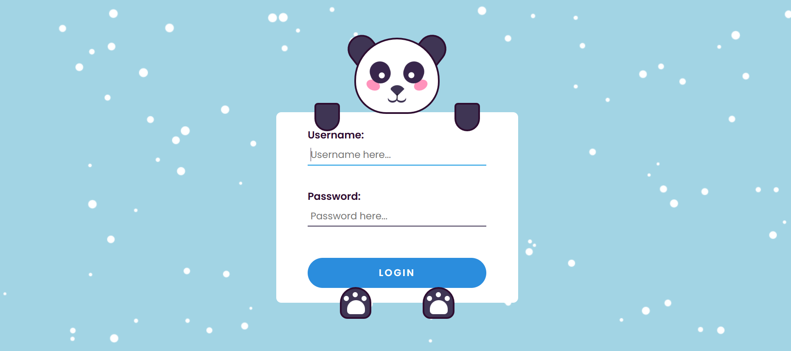

# Panda Login Animated Page - Web-Based Project

Welcome to the **Panda Login Animated Page**! This project showcases an animated login page featuring a playful panda character. The page is designed with **HTML**, **CSS**, and **JavaScript**, bringing a delightful experience for users. This code is completely **free**, and I’m offering it as a **Ramazan gift** to you all to spread some joy!. Follow me for more Free code

## Demos

  



Here’s the **[Demo Video](https://www.linkedin.com/posts/talha-masood-1st-7a8036285_webdevelopment-frontenddevelopment-animation-activity-7306165119225372672-SSB7?utm_source=share&utm_medium=member_android&rcm=ACoAAEU87_ABU3MT67sR-3fwY06dGiLqMK5waZ4)** to see the project in action!

## Features

- **Stunning Animations**: Smooth animations with a playful panda character to make the login process more fun and interactive.
- **Responsive Design**: Optimized for mobile, tablet, and desktop devices, ensuring great performance on any screen.
- **User-Friendly Interface**: Simple, intuitive, and easy-to-navigate login page for a seamless user experience.
- **Lightweight**: The code is clean, minimal, and designed for easy customization.

## Technologies Used

- **HTML5** - Structure and layout of the page.
- **CSS3** - Styling and animations for the panda and login elements.
- **JavaScript** - Interactive functionality (including animations and dynamic content).
- **Responsive Design** - Optimized for different screen sizes, from mobile to desktop.
- **CSS Animations** - For smooth and dynamic transitions throughout the page.

## Getting Started

To get started with this project locally, follow these steps:

### Prerequisites

Make sure you have a modern web browser installed (e.g., Google Chrome, Firefox, Safari).

### Installation

1. Clone the repository to your local machine:
   ```bash
   git clone https://github.com/TalhaMasood23/panda-login
